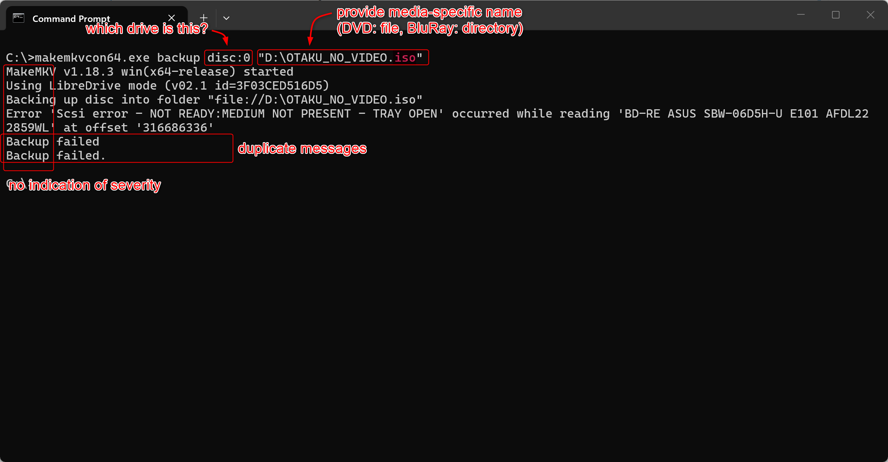
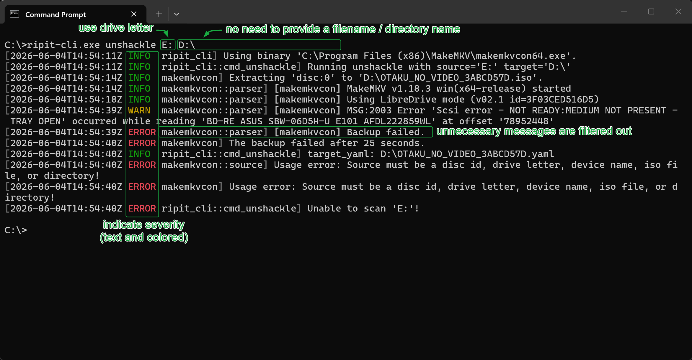

# ripit-cli

`ripit-cli` is a convenience wrapper for MakeMKV's command line utility
'makemkvcon'.

## Purpose

MakeMKV's graphical interface (makemkv.exe) and command line utility
(makemkvcon64.exe) are perfectly fine for processing a few discs. They
become somewhat inconvenient after the first dozen.

`ripit-cli` makes it trivial to process your whole collection.

> **Please note:** You still need to install MakeMKV.
>
> `ripit-cli` is a wrapper for `makemkvcon`. It does not implement disc
> reading functionality.

```MERMAID
---
title: ripit-cli in action
---
flowchart TD
    ripit-cli["ripit-cli"]

    unshackle("unshackle")
    identify("identify medium")
    backup["`**makemkvcon backup**`"]
    parse1("parse output")
    eject("eject medium")

    extract("extract")
    mkv["`**makemkvcon mkv**`"]
    parse2("parse output")

    scan("scan")
    info["`**makemkvcon info**`"]
    parse3("parse output")

ripit-cli --> unshackle --> identify --> backup --> parse1 --> eject --> identify
ripit-cli --> extract --> mkv --> parse2
ripit-cli --> scan --> info --> parse3
```

**Using makemkvcon:**



**Using ripit-cli:**



### Single Iteration

This command frees your content from its physical shell:

```SHELL
# Linux
ripit-cli unshackle /dev/sr0 /mnt/storage
# Windows
ripit-cli.exe unshackle E: D:\storage
```

Specifically it:

1. detects if the optical drive exists
2. identifies the inserted disc
3. runs `makemkvcon backup <...>`
4. reads the extracted data, parses the structure (titles, streams, etc.)
   and generates a YAML describing the content

The biggest benefits compared to makemkvcon are:

- **Colored log output.** Distinguishing clearly between informational, warning
  and error messages. Severity level of some messages is context dependent,
  these messages are classified and indicated appropriately.
- **Automatic generating of unique filenames.** There's no need to for the
  user to provide a filename for each processed disc.
- **Automatic identification of content type and output format.** DVDs are
  extracted as ISO files, BluRays are extracted as directories.
- **No lies or ommissions.** `makemkvcon info --minlength=x` and
  `makemkvcon mkv --minlength=x` are undocumented but vital to know.
  `makemkvcon backup` claims to support `dev:<device>` but doesn't.
  ripit-cli generates its help messages from its code, ensuring they are
  in sync.

### Multiple Iterations

ripit-cli allows the extraction of multiple disc with a single command.
This mode is extremely convenient when processing a TV show spanning
multiple discs.

1. start ripit-cli in continuous mode
2. insert disc
3. wait until disc is ejected
4. repeat step 2 until you're done
5. Ctrl-C

```SHELL
# Linux
ripit-cli unshackle --continuous /dev/sr0 extract
# Windows
ripit-cli.exe unshackle --continuous E: extract
```

## Contents

This repository provides 2 components:

- **makemkvcon**: A library which wraps makemkvcon with a nicer interface
  but doesn't change the underlying interface.
- **ripit-cli**: A command line application that provides its own user
  interface. It can be uses on its own or as a showcase how to use
  makemkvcon from your own Rust code.

> _Please note:_ This code was written by a seasoned programmer learning
> Rust. It combines a useful utility with a learning exercise. Expect to
> see unidiomatic code. Regardless of code quality, the aspiration is to
> have a usable application that is more convenient then makemkvcon.

## Versioning

This code uses [Semantic Versioning](https://semver.org) with the following
tweaks:

- If the change does not require changes to unit tests it's a `fix:`.
- If the change introduces a new unit tests it's a `feat:`.
- If the change modifies an existing unit tests it's a `feat!:`.

These tweaks are intended to make it obvious when a change would result in
a patch, a minor or a major release.

- Major releases could increase quickly. It's just a number, get over it.
- If untested code is changed it will never result in a minor or major
  release. This is intentional. The tests are the specification and
  documentation. The absence of test implies undefined behavior.

_Related:_ Refrain from using major versions for marketing purposes.
Assign a codename to highlight a specific major version.

## Maturity

### Code

| component | maturity level                      |
| --------- | ----------------------------------- |
| makemkv   | exploring, may change significantly |
| ripit-cli | exploring, may change significantly |

### Tooling

| component        | maturity level                 |
| ---------------- | ------------------------------ |
| dependabot       | untested                       |
| pre-commit hooks | working as desired, may change |
| release-please   | untested                       |
| (publishing)     | not implemented                |
