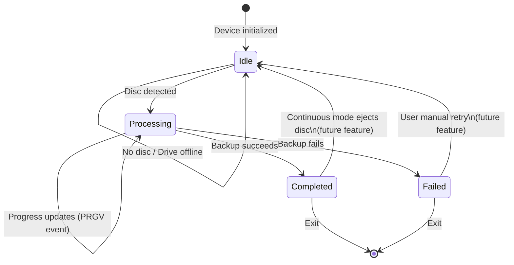
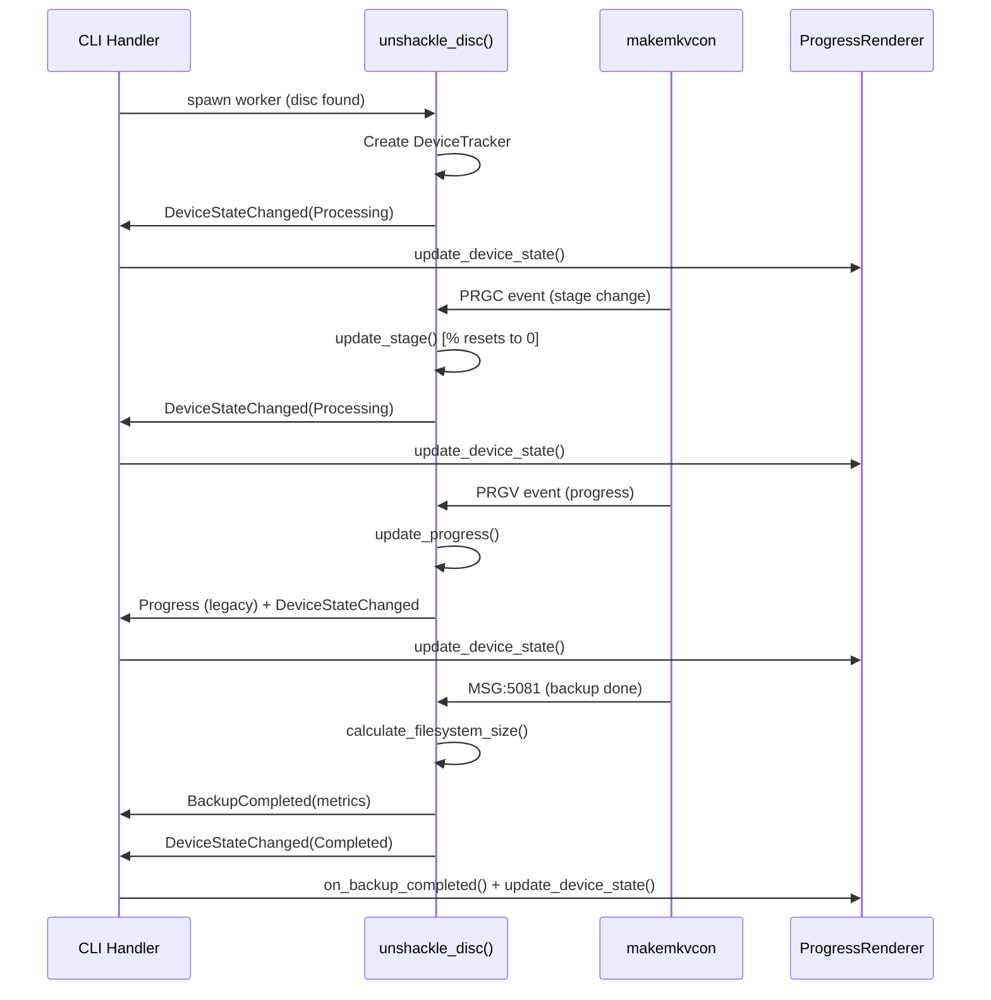

# Progress UI Design for Multi-Drive Backups

## Overview

This document describes the architecture and design decisions for displaying progress when backing up multiple optical media drives simultaneously using `ripit-cli unshackle`.

## Problem Statement

When backing up from 3 or more drives, the original line-by-line output becomes difficult to parse:

```
I: [/dev/sr0] Scanning CD-ROM devices:   0% (done: 0, failed: 1)
I: [/dev/sr1] Scanning CD-ROM devices:   0% (done: 0, failed: 1)
I: [/dev/sr2] Scanning CD-ROM devices:   0% (done: 0, failed: 1)
I: [/dev/sr0] Scanning CD-ROM devices:  50% (done: 0, failed: 1)
I: [/dev/sr1] Scanning CD-ROM devices:  50% (done: 0, failed: 1)
E: [/dev/sr2] Worker task for `makemkvcon backup` failed.
```

Users cannot easily answer: _"Which drives are actively running? What's the current status of each?"_

## Solution: Per-Device State Tracking

We implemented a unified **device state machine** that tracks each drive through its lifecycle with per-stage progress and deferred metrics.

### Key Design Principles

1. **Per-Device State Machine**: Each device has an explicit state (Idle → Processing → Completed/Failed) that updates atomically
2. **Per-Stage Progress**: Percentage counters reset to 0% when entering a new stage (e.g., "Scanning" → "Backing up")
3. **Deferred Metrics**: File size is only available after the backup completes; progress output doesn't wait for this
4. **Graceful Degradation**: Automatically detects TTY vs. pipes and renders appropriate output format
5. **Continuous Mode Ready**: Architecture supports future eject-and-wait workflows without changes

## Architecture

### Device State Machine



### Event Flow



## Type Hierarchy

### Core Enums

**`DiscType`** — Identifies the media format:
```rust
pub enum DiscType {
    Dvd,
    HdDvd,
    BluRay,
}
```

**`DeviceStatus`** — State of a single device (atomic update):

```rust
pub enum DeviceStatus {
    Idle { reason: String },                          // Empty, Not Ready, Waiting...
    Processing {
        disc_type: DiscType,
        disc_name: String,
        stage: String,                                // "Scanning", "Backing up", etc.
        percentage: f32,                              // Per-stage, resets to 0%
        elapsed_secs: u64,
    },
    Completed {
        disc_type: DiscType,
        disc_name: String,
        fs_size_bytes: u64,                           // Only available now
        elapsed_secs: u64,
    },
    Failed {
        error_description: String,
        elapsed_secs: u64,
    },
}
```

### Event Types

**`UnshackleEvent`** — Unified event channel:

```rust
pub enum UnshackleEvent {
    // Legacy events (backward compatible)
    MsgInfo(UnshackleMessage),
    MsgWarn(UnshackleMessage),
    MsgFail(UnshackleMessage),
    Progress(UnshackleProgress),  // Per-stage progress
    
    // New events (device state tracking)
    DeviceStateChanged(DeviceStateEvent),  // Atomic device state update
    BackupCompleted(BackupMetrics),       // Deferred metrics
}
```

### State Tracker

**`DeviceTracker`** — Per-device lifecycle management:

```rust
pub struct DeviceTracker {
    pub device: PathBuf,
    pub state: DeviceStatus,
    start_time: Instant,  // For elapsed time calculation
}

impl DeviceTracker {
    pub fn start_processing(disc_type, disc_name, stage) { ... }
    pub fn update_stage(new_stage) { ... }              // % resets to 0%
    pub fn update_progress(percentage) { ... }
    pub fn complete(disc_type, disc_name, fs_size) { ... }
    pub fn fail(error) { ... }
    pub fn return_to_idle(reason) { ... }               // Continuous mode
}
```

## Output Formats

### Interactive Output (TTY)

When stdout is a TTY, output updates in place using ANSI escape sequences:

```
Using target directory: /media/backup/dump/_dev2/

Device     Disc                      Stage              Progress   Time    
───────────────────────────────────────────────────────────────────────────
/dev/sr0   DVD: The Matrix           Processing titles   ████████░ 8:42   
/dev/sr1   Blu-Ray: Inception        Backing up contents ████░░░░░  7:20   
/dev/sr2   [Empty]                   –                   –           –      
───────────────────────────────────────────────────────────────────────────
Completed: 0 | Total output: 0 B
```

**Advantages:**
- ✅ Clear visual overview of all devices
- ✅ No terminal scrollback pollution
- ✅ Progress bars and timers are intuitive
- ✅ Disc type and name immediately visible

**Current Status:** Partial implementation in `ProgressRenderer::render_table_interactive()`. A full-featured version would use the `indicatif` or `ratatui` crate for advanced terminal control.

### Non-Interactive Output (Piped/Logged)

When stdout is piped or redirected, output uses a structured log format suitable for parsing:

```
I: Using target directory: /media/backup/dump/_dev2/
I: [/dev/sr0] Creating worker task for `makemkvcon backup`.
I: [/dev/sr1] Creating worker task for `makemkvcon backup`.
I: [/dev/sr2] Creating worker task for `makemkvcon backup`.
S: sr0 | PROG | Disc=DVD | Name=The Matrix | Stage=Scanning | 0% | Time=00:00
S: sr1 | PROG | Disc=BluRay | Name=Inception | Stage=Scanning | 0% | Time=00:00
S: sr0 | PROG | Disc=DVD | Name=The Matrix | Stage=Scanning | 50% | Time=00:05
S: sr1 | PROG | Disc=BluRay | Name=Inception | Stage=Scanning | 50% | Time=00:05
E: [/dev/sr2] Worker task for `makemkvcon backup` failed.
S: sr2 | IDLE | Reason=Empty
S: sr0 | PROG | Disc=DVD | Name=The Matrix | Stage=Processing titles | 0% | Time=00:10
S: sr0 | DONE | Disc=DVD | Name=The Matrix | Size=4.2 GiB | Time=12:34
S: sr1 | DONE | Disc=BluRay | Name=Inception | Size=6.5 GiB | Time=15:20
```

**Advantages:**
- ✅ Parseable with `grep`, `awk`, `sed`
- ✅ Machine-readable (prefix codes: `S:`, `I:`, `E:`, `W:`)
- ✅ Suitable for CI/CD pipelines and log aggregation
- ✅ Gracefully degrades for non-interactive environments

**Format:**
- `S: <device> | <state> | <fields>`  — State transition
- `I:` / `W:` / `E:` — Info / Warning / Error (existing)

Fields vary by state:
- `IDLE`: `Reason=<string>`
- `PROG`: `Disc=<type> | Name=<string> | Stage=<string> | <percent>% | Time=<MM:SS>`
- `DONE`: `Disc=<type> | Name=<string> | Size=<GiB> | Time=<MM:SS>`
- `FAIL`: `Error=<string> | Time=<MM:SS>`

## Per-Stage Progress Behavior

### Why Percentages Reset

MakeMKV events are generated independently for each stage:

1. **Scanning CD-ROM devices**: `PRGV(0/100)` → `PRGV(100/100)`
2. **Transition** (PRGC event fired): `percentage := 0%`
3. **Processing title sets**: `PRGV(0/5000)` → `PRGV(5000/5000)`

Without resetting, users see confusing jumps:
- `Scanning 99%` → `Processing 0.02%` (looks like it dropped!)

With resetting:
- `Scanning 99%` → `[stage changes]` → `Processing 0%` (clear progression)

### Implementation

```rust
// When PRGC event arrives (new stage)
device_tracker.update_stage(new_stage);  // Sets percentage = 0.0

// When PRGV event arrives (progress in current stage)
device_tracker.update_progress(percentage);  // Updates percentage, updates elapsed
```

## Deferred File Size Availability

### Problem

File sizes are only known after `makemkvcon backup` completes and we can call `calculate_filesystem_size()`.

Early designs wanted to show:
```
/dev/sr0   DVD: Matrix   Processing   50%   2.1 GiB / ?? GiB
```

But `?? GiB` is unknowable until the end.

### Solution

Display size only in `Completed` state:

```
/dev/sr0   DVD: Matrix   ✓ Complete   100%   4.2 GiB
```

The `ProgressRenderer::on_backup_completed()` call includes the metrics, and state is updated atomically.

## Continuous Mode Forward Compatibility

For future continuous-mode support (eject and wait for next disc):

### State Transitions

```
[Completed] 
  ↓ (eject disc, emit event)
[Idle] with reason="Waiting for disc..."
  ↓ (new disc detected)
[Processing] with new disc_type and disc_name
  ↓
[Completed] or [Failed]
```

### Implementation Ready

```rust
// When continuous mode ejects:
device_tracker.return_to_idle("Waiting for disc...".to_string());
tx.send(UnshackleEvent::DeviceStateChanged(...)).await;

// When new disc detected:
device_tracker.start_processing(disc_type, disc_name, "Initializing".to_string());
tx.send(UnshackleEvent::DeviceStateChanged(...)).await;
```

Current code in `DeviceTracker::return_to_idle()` supports this workflow without changes.

## Backward Compatibility

The `Progress` event is still emitted alongside `DeviceStateChanged` for backward compatibility:

```rust
// Emit both events when progress updates
tx.send(UnshackleEvent::Progress(legacy_progress)).await;
tx.send(UnshackleEvent::DeviceStateChanged(state_event)).await;
```

Existing code consuming `Progress` events continues to work unchanged.

## Future Enhancements

### Interactive Table Rendering

The current implementation uses the **`indicatif` crate** for professional progress bar rendering:

**Features:**
- ✅ Multi-progress tracking with one progress bar per device
- ✅ Updates in place using ANSI escape sequences (no terminal scrollback)
- ✅ Animated spinner and smooth progress transitions
- ✅ Per-device status messages with device name, disc type, stage, and elapsed time
- ✅ Truncates long strings with ellipsis to fit terminal width
- ✅ Atomic state updates (no glitching or partial renders)

**Example output (interactive TTY):**

```
⠏ [████████████░░░░░░░░] 65% sr0: DVD | The Matrix | Proc… | Time: 08:42
⠇ [██████████░░░░░░░░░░] 55% sr1: Blu-Ray | Inception | Back… | Time: 07:20
⠋ [░░░░░░░░░░░░░░░░░░░░] 0%  sr2: [Empty]
```

**Current Status:** Fully implemented in `ProgressRenderer::update_interactive_progress()` and uses indicatif's `MultiProgress` and `ProgressBar` types for atomic updates.

**Key Components:**
- `MultiProgress` — Manages multiple concurrent progress bars
- `ProgressBar::set_message()` — Updates the status text without overwriting progress
- `ProgressBar::set_position()` — Updates the progress percentage
- `ProgressStyle` — Customizable rendering template with spinner animation

**Usage:**

```rust
// In main event loop:
match event {
    DeviceStateChanged { device, status } => {
        progress.update_device_state(device, status);
        // Interactive rendering happens automatically
    }
}
```

The implementation automatically handles:
- Creating progress bars on first device state update
- Updating existing bars for subsequent state changes
- Marking bars as finished when devices complete/fail
- Thread-safe rendering via `Arc<Mutex<...>>`

### JSON Output Mode

For CI/CD integration, a `--output json` flag could emit structured data:

```json
{
  "device": "/dev/sr0",
  "disc_type": "DVD",
  "disc_name": "The Matrix",
  "stage": "Processing title sets",
  "percentage": 75,
  "elapsed_secs": 450,
  "state": "processing"
}
```

## Future Enhancements

### Terminal Width Handling

The current implementation truncates long strings to fit common terminal widths. Future versions could:

1. **Detect terminal width** using the `term_size` crate
2. **Dynamically adjust formatting** based on available columns
3. **Fall back gracefully** if terminal width changes during execution

### Performance Metrics Dashboard

Show per-device performance data at completion:

```
Device Performance:
  sr0 (DVD):      4.2 GiB in 12:34 = 12.1 MiB/s
  sr1 (Blu-Ray):  6.5 GiB in 15:20 = 10.8 MiB/s
  sr2 (Failed):   –
```

### JSON Output Mode

For CI/CD integration, a `--output json` flag could emit structured data.

## Testing

The `DeviceTracker` type includes unit tests for state transitions and formatting:

```bash
cargo test -p ripit device_state::tests
```

The `ProgressRenderer` type includes tests for time and progress bar formatting:

```bash
cargo test -p ripit-cli progress_renderer::tests
```

## Troubleshooting

### Progress appears stuck at 0%

- **Cause**: Stage change (PRGC event) not received yet
- **Expected**: Percentage resets to 0% for each new stage
- **Check**: Verify `makemkvcon` is emitting PRGC events

### File size shows as "–" after completion

- **Cause**: `calculate_filesystem_size()` failed or target path is invalid
- **Expected**: File size should be available immediately after backup
- **Check**: Verify target directory permissions and disk space

### Non-interactive output not appearing

- **Cause**: Logger level set to WARN or ERROR
- **Solution**: `RUST_LOG=info ripit-cli unshackle ...`

## References

- [MakeMKV Event Types](../makemkv-output.md)
- [Device State Machine Implementation](../../libs/ripit/src/unshackle/device_state.rs)
- [CLI Progress Rendering](../../ripit-cli/src/cmd_unshackle/progress_renderer.rs)
- [unshackle_disc() Function](../../libs/ripit/src/unshackle/mod.rs)
